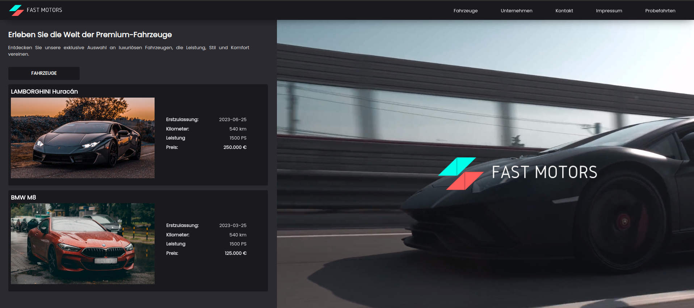
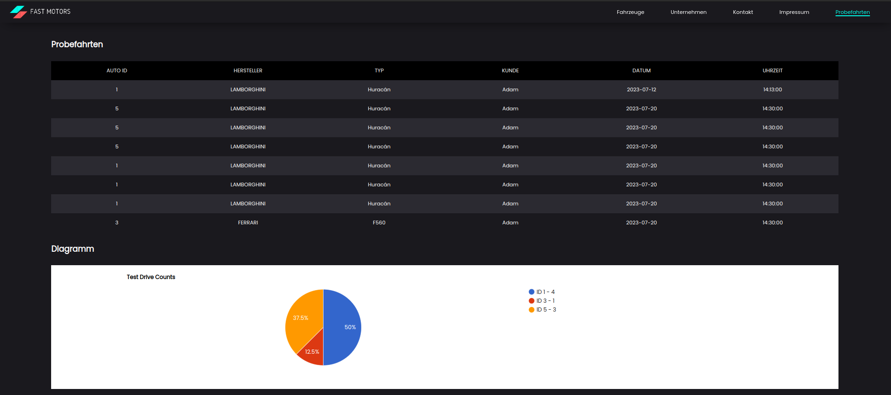

# FastMotion Car Website



Welcome to the FastMotion Car Website repository! This repository contains the source code and assets for a car website built using HTML, CSS, and JavaScript. The website showcases various car models, allowing users to explore different car features, view images, and find relevant information.

## Table of Contents

- [Demo](#demo)
- [Features](#features)
- [Getting Started](#getting-started)
- [Contributing](#contributing)

## Demo

To see a live demo of the FastMotion Car Website, visit [https://as825.github.io/FastMotion-CarWebsite/](https://as825.github.io/FastMotion-CarWebsite/).

## Features

# Statistics


The FastMotion Car Website offers the following features:

- **Car Model Gallery**: Browse a collection of car models, each with detailed information and images.
- **Search Functionality**: Search for specific car models by name or filter them by different attributes.
- **Responsive Design**: The website is optimized for different screen sizes, ensuring a seamless experience on both desktop and mobile devices.
- **Smooth Transitions**: Enjoy smooth page transitions and animations for an enhanced user experience.
- **Interactive Elements**: Engage with interactive elements such as image sliders and car configuration options.

## Getting Started

To run the FastMotion Car Website locally on your machine, follow these steps:

1. **Clone the repository**: 
```git clone https://github.com/AS825/FastMotion-CarWebsite.git```
2. **Navigate to the project directory**: ```cd FastMotion-CarWebsite```

3. **Open the website**:

- If you have a preferred development environment, open the project in the IDE of your choice.
- Alternatively, you can directly open the `index.html` file in your web browser.

That's it! You should now have the FastMotion Car Website up and running locally.

## Backend Development

The FastMotion Car Website includes a Java backend built with the Spring framework. The backend handles data retrieval and processing, providing the necessary information to the frontend.

To set up and run the backend, follow these additional steps:

1. **Install Java Development Kit (JDK)**:
- Make sure you have JDK 8 or above installed on your machine.

2. **Install Apache Maven**:
- Maven is used as the build tool for the backend.
- Install Maven by following the instructions at [https://maven.apache.org/install.html](https://maven.apache.org/install.html).

3. **Configure Database Connection**:
- The backend requires a database connection to retrieve car model data.
- Configure the database connection details in the `application.properties` file located in the `src/main/resources` directory.

4. **Build and Run the Backend**:
- Open a terminal or command prompt and navigate to the project directory.
- Build the backend using Maven:
  ```
  mvn clean install
  ```
- Run the backend using Maven:
  ```
  mvn spring-boot:run
  ```

The backend should now be running, and the frontend can interact with it to retrieve data.

## Contributing

Contributions to the FastMotion Car Website are always welcome. If you find any issues or have suggestions for improvements, please open an issue in the repository.

If you'd like to contribute code to the project, follow these steps:

1. Fork the repository.
2. Create a new branch for your feature or bug fix.
3. Make your changes and commit them with descriptive commit messages.
4. Push your changes to your forked repository.
5. Open a pull request in the main repository, explaining the changes you've made.

